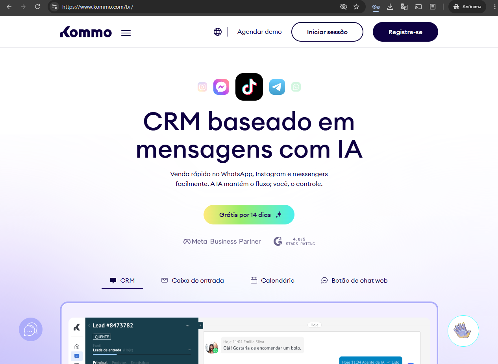
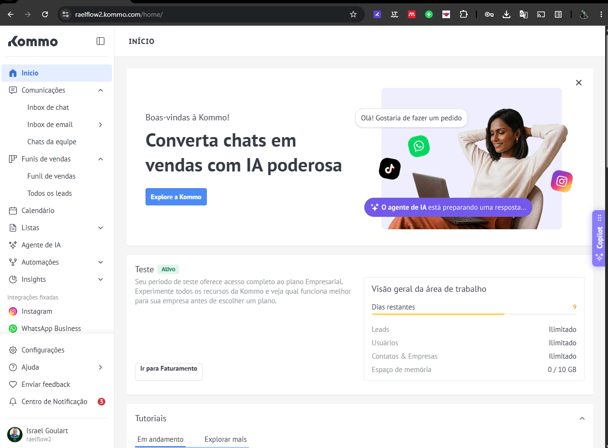
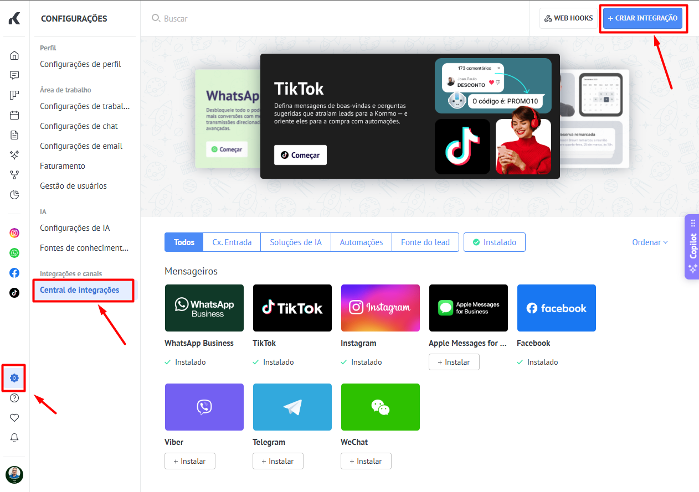
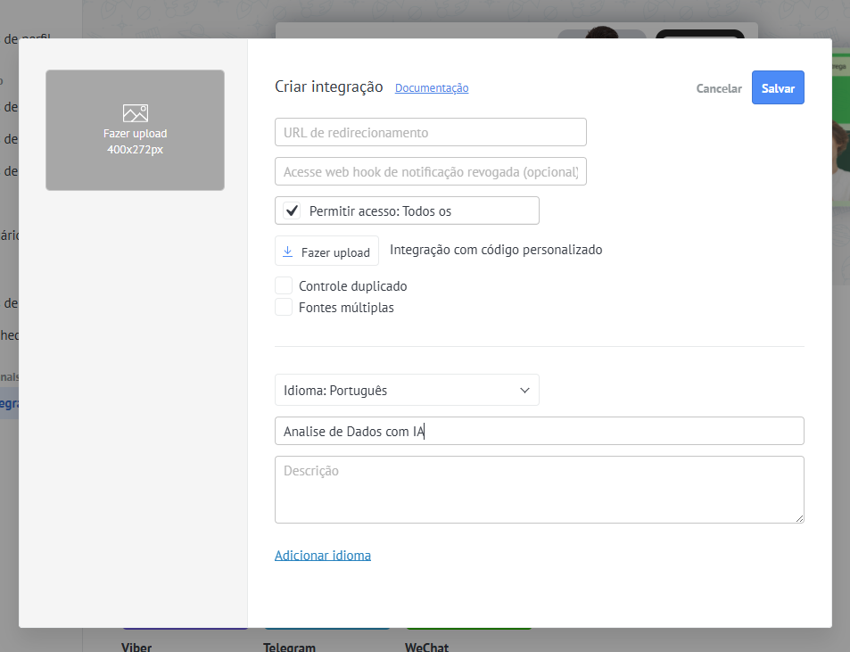
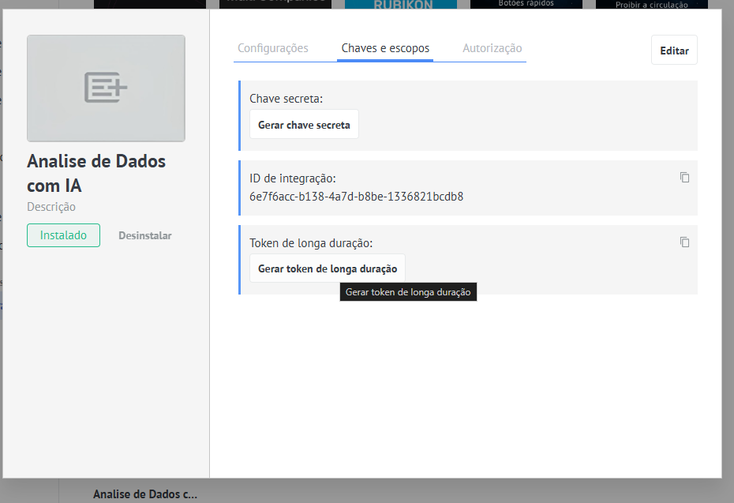

# Processo de coleta dos dados para realizar authenticação no kommo CRM. 

## Acesso
Link: https://www.kommo.com/br/

1. Faça o Cadastro e crie um crm novo. Use um email valido pois sera necessario envio de codigo em uma etapa a frente.
2. Faça login
3. Preencha os dados iniciais solicitados pela plataforma.

**A tela que vai aparecer apos login e indiferente, apenas se atente nas opções do menu latereal para navegar ate o local indicado abaixo**

4. Encontre a opções de Configurações no menu lateral, clique nele e vai aparer outras opções, acesse a opção de Central de Integrações.
5. No canto superior direito teremos o botão Criar Integração, clique nele.

6. Aqui e onde você cria a integração para permitir utilizar a API da plataforma. O uso da URL de Redirecionamento permite conexão via OAuth 2. Mas vamos seguir as configurações usando o token de longa duração para facilitar o processo, mas para segurança e recomendado o uso do OAuth 2. Portanto Basta Preenche o Nome da Integração.
7. Ao clicar em salvar, sera enviado exibido uma tela de confirmação, clique em enviar o codigo, aqui e onde você vai usar o email que colocou na hora de cadastar na plataforma, acesse seu email colete o codigo e confirme.

8. Integração criada agora clique na aba Chaves e escopos. E depois em Gerar token de Longa duração, escolha uma data de validade a sua escolha. Copie tal token e salve em local seguro para usar no n8n para acessar a api da plataforma. 

